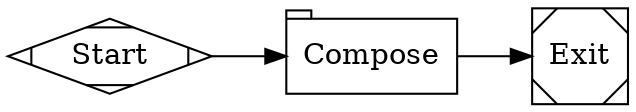
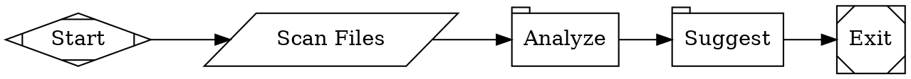
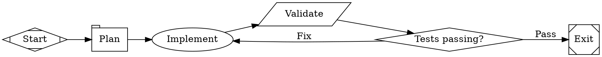
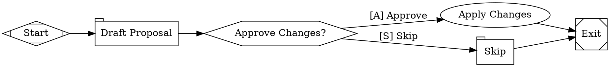
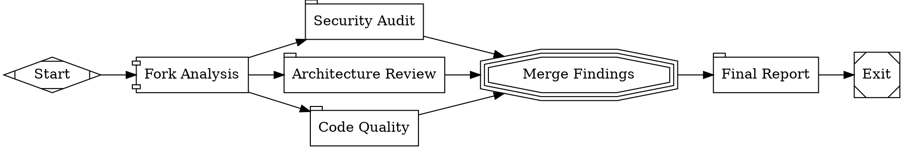
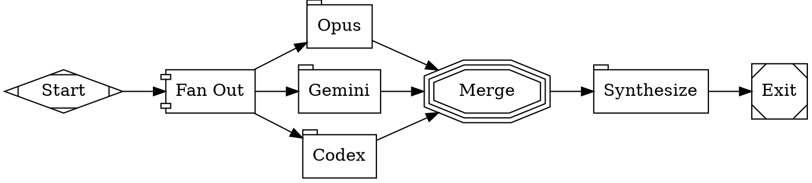

# Example Workflows

Use these as starting points. Choose the simplest topology that fits the requirements.

## 1. Linear Pipeline (simplest)

One-shot prompt, no tools:



## 2. Command-Then-Analyze Pipeline

Shell command feeds into LLM analysis:



## 3. Implement-Test-Fix Loop

Agent writes code, command validates, conditional routes back on failure:



## 4. Human Approval Gate

Draft, get human approval, then apply:



## 5. Plan-Approve-Implement with Revision Loop

```dot
digraph PlanImplement {
    graph [goal="Plan, approve, implement, and simplify a change"]
    rankdir=LR

    start [shape=Mdiamond, label="Start"]
    exit  [shape=Msquare, label="Exit"]

    plan      [label="Plan", prompt="Analyze the goal and codebase. Write a clear, step-by-step implementation plan to plan.md. Include what files will change and why.", reasoning_effort="high"]
    approve   [shape=hexagon, label="Approve Plan"]
    implement [label="Implement", prompt="Read plan.md and implement every step. Make all the code changes described in the plan."]
    simplify  [label="Simplify", prompt="Review the changes just made. Simplify and clean up the code without changing behavior."]

    start -> plan -> approve
    approve -> implement [label="[A] Approve"]
    approve -> plan      [label="[R] Revise"]
    implement -> simplify -> exit
}
```



## 6. Parallel Fan-Out Review

Multiple independent analyses merged into a synthesis:



## 7. Multi-Model with Stylesheet

Different models for different roles:

```dot
digraph MultiModel {
    graph [
        goal="Build and review a utility function using multiple models",
        model_stylesheet="
            * { model: claude-haiku-4-5;reasoning_effort: low; }
            .coding { model: claude-sonnet-4-6;reasoning_effort: high; }
            #review { model: claude-sonnet-4-6;reasoning_effort: high; }
        "
    ]
    rankdir=LR

    start [shape=Mdiamond, label="Start"]
    exit  [shape=Msquare, label="Exit"]

    spec      [label="Write Spec", prompt="Write a brief spec for a TypeScript string utility module with 3 functions: slugify, truncate, and capitalize. Output the spec only.", shape=tab]
    implement [label="Implement", prompt="Implement the TypeScript string utility module from the spec. Write it to string-utils.ts.", class="coding"]
    test      [label="Write Tests", prompt="Write tests for the string utility module using Bun's test runner. Write to string-utils.test.ts.", class="coding"]
    review    [label="Code Review", prompt="Review the implementation and tests. Check for edge cases, type safety, and correctness. Provide a brief verdict.", shape=tab]

    start -> spec -> implement -> test -> review -> exit
}
```



## 8. Multi-Provider Ensemble

Independent opinions from multiple providers, then synthesize:



## 9. Production Implement-and-Simplify with Verification

Full pipeline with toolchain checks, lint loops, and verification gates:

```dot
digraph ImplementAndSimplify {
    graph [
        goal="Implement and simplify",
        model_stylesheet="
            * { backend: api; model: claude-opus-4-6;}
        "
    ]
    rankdir=LR

    start [shape=Mdiamond, label="Start"]
    exit  [shape=Msquare, label="Exit"]

    toolchain         [label="Toolchain", shape=parallelogram, script="command -v cargo >/dev/null || { curl --proto '=https' --tlsv1.2 -sSf https://sh.rustup.rs | sh -s -- -y && sudo ln -sf $HOME/.cargo/bin/* /usr/local/bin/; }; cargo --version 2>&1", max_retries=0]
    preflight_compile [label="Preflight Compile", shape=parallelogram, script="cargo check 2>&1", max_retries=0]
    preflight_lint    [label="Preflight Lint", shape=parallelogram, script="cargo clippy -- -D warnings 2>&1", max_retries=0]
    fix_lints         [label="Fix Lints", prompt="The preflight lint step failed. Read the build output from context and fix all clippy lint warnings.", max_visits=3]
    implement         [label="Implement", prompt="Read the plan file referenced in the goal and implement every step. Make all the code changes described in the plan."]
    simplify          [label="Simplify", prompt="Review the changes just made. Simplify and clean up the code without changing behavior."]
    verify            [label="Verify", shape=parallelogram, script="cargo clippy -- -D warnings 2>&1 && cargo test 2>&1", goal_gate=true, retry_target="fixup"]
    fixup             [label="Fixup", prompt="The verify step failed. Read the build output from context and fix all clippy lint warnings and test failures.", max_visits=3]

    start -> toolchain
    toolchain -> preflight_compile [condition="outcome=success"]
    toolchain -> exit
    preflight_compile -> preflight_lint [condition="outcome=success"]
    preflight_compile -> exit
    preflight_lint -> implement [condition="outcome=success"]
    preflight_lint -> fix_lints
    fix_lints -> preflight_lint
    implement -> simplify -> verify
    verify -> exit  [condition="outcome=success"]
    verify -> fixup
    fixup -> verify
}
```



Paired TOML:

```toml
version = 1
graph = "workflow.fabro"

[sandbox]
provider = "local"

[sandbox.local]
worktree_mode = "always"
```

## 10. Browser-Based UI Testing with agent-browser

Parallel browser test suites that validate a web app's UI and interactions using [agent-browser](https://agent-browser.dev) CLI commands. Each test agent opens the app, interacts like a human, takes screenshots, records video, and writes results to a timestamped directory.

**Key patterns:**
- Test agents use `backend: cli` so they get shell access to run `agent-browser` commands
- Tests are written in plain English with embedded CLI commands — no Playwright scripts needed
- A `setup_dirs` node creates a timestamped output directory (`YYYY-MM-DD_HH-MM-SS`) so runs don't overwrite each other
- Screenshots go in a `screenshots/` subdir, videos in `videos/`, result markdown at the root
- `agent-browser record start/stop` captures WebM video of each test suite for demo purposes

```dot
digraph BrowserTesting {
    graph [
        goal="Validate web app UI and functionality through browser-based testing",
        model_stylesheet="
            *          { model: claude-sonnet-4-6; backend: cli; }
            .testing   { model: claude-sonnet-4-6; backend: cli; }
            .reporting { model: claude-haiku-4-5; reasoning_effort: low; }
        "
    ]
    rankdir=LR

    start [shape=Mdiamond, label="Start"]
    exit  [shape=Msquare, label="Exit"]

    build [label="Build App", shape=parallelogram, script="bun run build 2>&1"]
    setup_dirs [label="Setup Output Dirs", shape=parallelogram, script="export RUN_ID=$(date '+%Y-%m-%d_%H-%M-%S') && echo $RUN_ID > /tmp/test-run-id && mkdir -p test-results/$RUN_ID/screenshots test-results/$RUN_ID/videos && echo \"Run directory: test-results/$RUN_ID\""]
    serve [label="Start Server", shape=parallelogram, script="python3 -m http.server 9753 &>/dev/null & echo $! > /tmp/test-server.pid && sleep 1 && echo 'Server ready'"]

    fork [label="Run Test Suites", shape=component, join_policy="wait_all", error_policy="continue"]

    test_visual    [label="Visual Verification", class="testing", prompt="@prompts/test_visual.md"]
    test_controls  [label="Controls & Input", class="testing", prompt="@prompts/test_controls.md"]
    test_logic     [label="Business Logic", class="testing", prompt="@prompts/test_logic.md"]

    merge [label="Collect Results", shape=tripleoctagon]

    stop_server [label="Stop Server", shape=parallelogram, script="kill $(cat /tmp/test-server.pid 2>/dev/null) 2>/dev/null; rm -f /tmp/test-server.pid; agent-browser close 2>/dev/null; echo 'Cleanup done'"]

    check [shape=diamond, label="All tests passed?"]
    report_pass [label="Pass Report", class="reporting", prompt="@prompts/report_pass.md", shape=tab]
    report_fail [label="Fail Report", class="reporting", prompt="@prompts/report_fail.md", shape=tab]

    start -> build
    build -> setup_dirs [condition="outcome=success"]
    build -> exit
    setup_dirs -> serve
    serve -> fork
    fork -> test_visual
    fork -> test_controls
    fork -> test_logic
    test_visual -> merge
    test_controls -> merge
    test_logic -> merge
    merge -> stop_server -> check
    check -> report_pass [label="Pass", condition="outcome=success"]
    check -> report_fail [label="Fail"]
    report_pass -> exit
    report_fail -> exit
}
```



Paired TOML:

```toml
version = 1
graph = "workflow.fabro"

[setup]
commands = ["bun install", "agent-browser install 2>/dev/null || true"]
timeout_ms = 60000

[sandbox]
provider = "local"

[sandbox.local]
worktree_mode = "never"

[assets]
include = ["test-results/**"]
```

**Output directory structure** (per run):

```
test-results/
  2026-03-23_19-45-00/
    visual.md
    gameplay.md
    scoring.md
    REPORT.md
    screenshots/
      v1-waiting-screen.png
      v2-playing-screen.png
      g1-before.png
      ...
    videos/
      visual-walkthrough.webm
      gameplay-controls.webm
      scoring-progression.webm
```

**Writing test prompts for agent-browser:** Each test prompt file should include:

1. A quick-reference of `agent-browser` commands the agent will need
2. A setup block that reads the run ID: `RUN_ID=$(cat /tmp/test-run-id)`
3. `agent-browser record start` at the beginning to capture video
4. Test cases written in plain English with embedded CLI commands
5. Expected outcomes to verify visually from screenshots
6. `agent-browser record stop` and `agent-browser close` in cleanup
7. Output format (write results to `test-results/$$RUN_ID/<suite>.md`)

Example test prompt structure:

```markdown
# Test Suite Name

Use `agent-browser` CLI to test the app.

## How to use agent-browser
agent-browser open <url>              # Navigate to URL
agent-browser snapshot                # Accessibility tree with @refs
agent-browser snapshot -i             # Interactive elements only
agent-browser screenshot <path>       # Capture screenshot
agent-browser press <key>             # Press key (ArrowLeft, Space, Enter, etc.)
agent-browser click @e1               # Click element by ref
agent-browser type @e1 <text>         # Type into element
agent-browser eval <js>               # Run JavaScript
agent-browser record start <path>     # Start video recording (WebM)
agent-browser record stop             # Stop recording
agent-browser close                   # Close browser

## Setup
RUN_ID=$(cat /tmp/test-run-id)
agent-browser open http://localhost:9753
agent-browser record start test-results/$$RUN_ID/videos/suite-name.webm

## TC-1: Test Case Name
[Plain English description of what to do and what to expect]
agent-browser press Enter
agent-browser screenshot test-results/$$RUN_ID/screenshots/tc1.png
Verify: [what should be visible in the screenshot]

## Cleanup
agent-browser record stop
agent-browser close

Write results to test-results/$$RUN_ID/suite-name.md
```

**Tips:**
- Canvas-based apps can't be inspected via DOM — use screenshots for visual verification
- For DOM-based apps, use `agent-browser snapshot -i` to find interactive element refs, then `click @ref`
- agent-browser output is compact text (not JSON) — optimized for AI token efficiency
- Each parallel test agent gets its own browser session — no conflicts
- Video recording captures the full interaction for demos and debugging — especially useful for games and animations
- Timestamped directories sort newest-first and prevent overwriting previous runs
